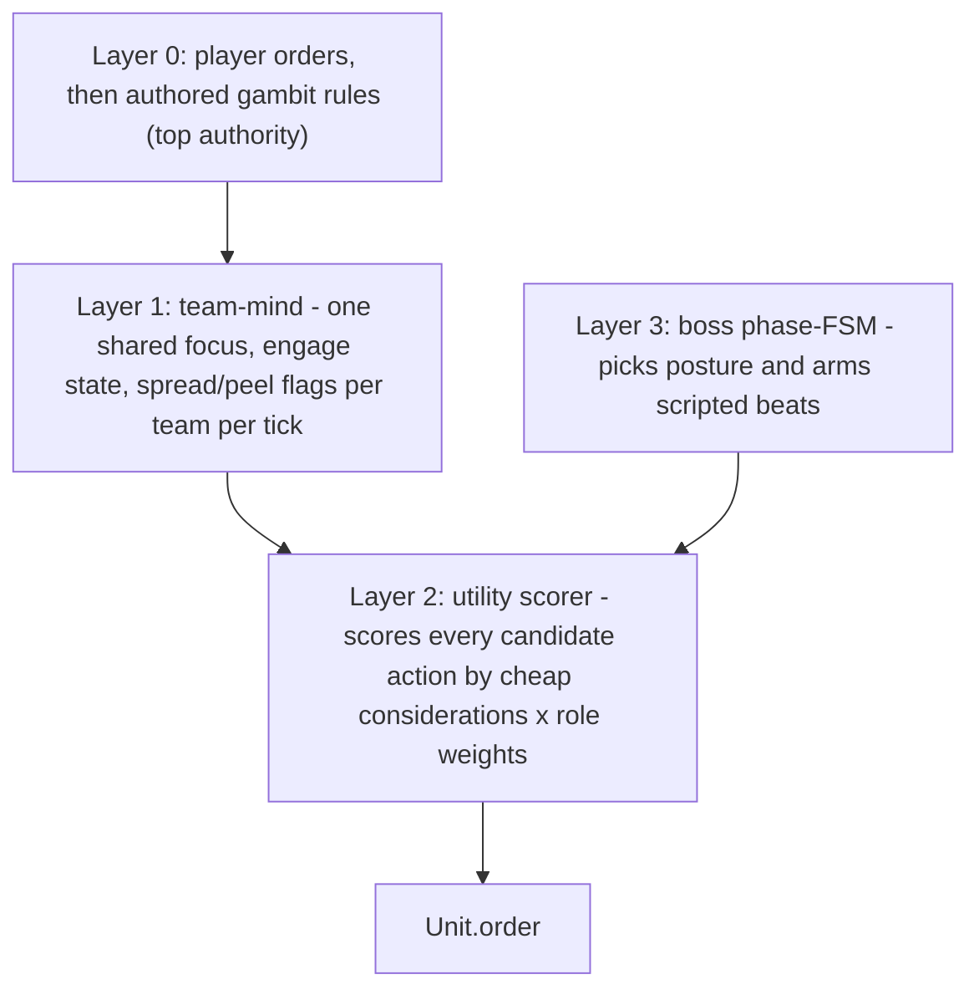

# AI OVERHAUL — a brain for the autobattler, team fights, and raids

How the combat AI stops being a blob that walks forward and trades, and starts playing like a team that knows what it is. Companion to `SPEC.md` (§1.1 controllers, §4 raids, §7 macro), `COMBAT_OVERHAUL.md` (which connected the player's hands to the sims), and `PROGRESS.md`.

Same footing as the rest of the project. The headless deterministic core (`src/core/`) stays the system of record. It never imports `three`, never touches the DOM, and stays deterministic for a seed. `COMBAT_OVERHAUL.md` did the control work: the combat context, the real Captain's Call, and the live raid session all landed. This document is about the brain underneath all of it. Every change here is additive, data-driven, and reversible. The boundary test (`src/test/boundary.test.ts`) stays green and the headless auto-resolve paths stay the tested reference.

---

## 0. WHERE WE ARE — measured honestly

The gambit grammar already grew past what `COMBAT_OVERHAUL.md` §3.2 called missing. `kite`, `dodge-zones`, `focus-fire`, `most-dangerous`, and `enemy-casting` all ship, the editor exposes them, and `src/test/gambit-ai.test.ts` covers three of them. The control plumbing is done. What stayed shallow is the decision-making.

Four findings.

**Finding 1 — units fire abilities in slot order.** Creeps and the raid boss share one routine that casts the first ready ability whose target is in range:

```104:117:src/core/controllers.ts
function maybeCastBasicAbility(sim: Sim, u: Unit, enemy: Unit): void {
  for (let slot = 0; slot < u.abilities.length; slot++) {
    const a = u.abilities[slot];
    if (a.level <= 0) continue;
    ...
    if (!u.abilityReady(slot, sim.time).ok) continue;
```

There is no sense of value. A nuke and a steroid fire in whatever order the kit lists them, on whatever target is nearest, with no idea whether the cast is worth it.

**Finding 2 — every hero targets alone.** Each unit picks its own focus through a private low-HP-and-near heuristic:

```241:251:src/core/controllers.ts
function pickFocus(sim: Sim, u: Unit): Unit | null {
  ...
  const hpScore = o.hp / o.stats.maxHp;
  const distScore = dist(o.pos, u.pos) / 4000;
  const heroBias = o.kind === 'hero' ? 0 : 0.5;
```

Five heroes spread across five targets. `focus-fire` sets only the caster's own focus, so a team never converges. Teamfights read as two blobs colliding until one dissolves.

**Finding 3 — the boss is a creep with a big health bar.** `thinkBoss` resolves a threat or taunt target, then calls the same slot-order ability routine. Its mechanics (add waves, zones, the signature beat, enrage) live in `createRaidMechanicRunner` in `src/core/macro.ts` and fire on boss health thresholds. They are a side channel, not decisions the boss makes. The same boss does the same thing at the same health every attempt.

**Finding 4 — threat is raw damage, and only the boss has it.** Threat is one number per attacker, accumulated as damage dealt:

```67:70:src/core/combat.ts
    if (victim.ctrl.kind === 'boss') {
      const threat = victim.ctrl.threat ?? (victim.ctrl.threat = {});
      threat[source.uid] = (threat[source.uid] ?? 0) + amount;
    }
```

`SPEC.md` §4 promises that "damage and healing generate threat" and "the carry rides the threat ceiling." Healing generates nothing today. There is no tank multiplier, no aggro threshold to stop the boss flipping targets every tick, and a taunt only overrides for its duration instead of buying the tank a real lead.

---

## 1. THE MODEL — a hybrid brain, settled

The proven pattern for this kind of agent is the one Valve's own Dota bots use and the one most combat AI converged on: a thin outer layer that decides what mode you are in, and a utility scorer inside that mode that decides the moment-to-moment action. Valve's bots score each mode's desire from 0 to 1 and run the highest; ability and item use are separate "consider" functions that return a desire and a target. We adopt the same shape, layered so authored intent always wins and the core stays deterministic.



- **Layer 0 stays as it is.** Player orders win first. Then the gambit rule list, the readable FF12-style list the editor builds. A rule that fires still decides the action. The scorer only runs when no rule pins the move, which today is the spot that falls back to "attack focus."
- **Layer 1, the team-mind, is new.** A small struct on `Sim`, computed once per team per decision tick. It picks one shared focus for the team, tracks an engage state (hold until the initiator commits, then everyone bursts), and raises context flags (an enemy area effect is up, so spread; enemy burst is loaded, so do not dive). This is the team-desires idea from the bot model, scaled to a 5v5.
- **Layer 2, the utility scorer, is the heart.** When the move is open, it enumerates candidate actions (cast this ability at that target, use this item, attack the focus, kite, peel to a diving ally, step out of a zone) and scores each one from a handful of cheap considerations: range, cooldown, mana, expected value against the target, how many units an area effect would catch, whether an ally is in danger, how much threat headroom the caster has. The highest score becomes the order. One scorer serves creeps, gambit heroes, and the boss. The per-role and per-attribute weights are where a hero's character lives.
- **Layer 3, the boss phase-FSM, is new.** A short machine (opening, sustained, health sub-phases, enrage, desperation) selects a posture, which is a set of scorer weights plus the beats that are armed in that phase. Inside a phase the boss uses the same scorer to choose targets and casts. It can hold its big area effect until the party clusters, swing to the healer when threat allows, or interrupt a clutch channel.

Everything stays a pure function of sim state with data-driven weights. The scorer reads positions, health, cooldowns, and statuses, all deterministic. Ties break by uid. Boss variety comes from the seeded `sim.rng`, so a replay of the same seed is identical.

---

## 2. PILLAR ONE — the autobattler (gyms, Elite Five, auto-resolve)

Gyms and the Elite Five keep pure-Dota parity, per `SPEC.md` §4 and §10. Both sides field the same upgraded brain, fixed and symmetric. The depth-as-difficulty lever in §4 below stays out of the gym layer so competitive feel is clean.

- Ability, item, and target choice route through the Layer 2 scorer, which retires slot-order firing. A nuker now leads with its burst on the right target instead of its first-listed spell on the nearest body.
- Reactive considerations let a gambit answer a play: `enemy-cast-seen` with a category (blink, ult, channel) is the trigger `SPEC.md` §7 named, plus `self-disabled` and `incoming-disable`. These enable "BKB when their initiator ults" and "save the ally being dived."
- Item actives get their own consider functions, the way the bot model gives each item a desire: BKB on a hard disable, Force Staff to escape or chase, Glimmer to save, Mekansm on a wounded cluster, Eul on the blink-in.
- The headless `runGymMatch` and the live fight share `LiveGymFight`, so both inherit the brain with no extra wiring, and the auto-resolve stays the balance reference.

## 3. PILLAR TWO — team fights and characteristics

A unit should fight like itself. Its character comes from four things it already carries: its role, its attribute, its attack range, and the shape of its kit.

- A `combatProfile`, derived from `HeroDef.roles`, `attribute`, `baseStats.attackRange`, and ability targeting tags, produces a weight set and a preferred posture (frontline, midline, backline). A carry kites, holds attack range, and rides the threat ceiling. A nuker bursts the most dangerous target. A support peels, saves, and zones. An initiator holds until the opening, then commits. A durable hero fronts and soaks. The profile is data the scorer reads, so behavior reads as Sven, Crystal Maiden, or Tidehunter without a line of per-hero AI code.
- The team-mind delivers the combo. A shared focus makes five heroes converge, and the engage state sequences the wombo: the initiator lands the opener, the team pours burst onto the shared focus, the support holds a save. Spacing reacts to the enemy composition, so a team spreads against area threats.
- Counterplay reads come from the same considerations: focus the enemy support, peel your carry off their initiator, scatter against a Tidehunter.
- The vocabulary stays closed, the scope guard from `COMBAT_OVERHAUL.md` §3.2. Characteristics are weights, postures, and considerations, not bespoke scripts. A behavior that seems to need a custom script gets redesigned as a consideration plus a weight.

## 4. PILLAR THREE — raids

- **The threat model is rebuilt** on the WoW-style rules `SPEC.md` §4 already points at. Damage adds threat one for one. Effective healing adds threat at half rate, credited to the healer, with no threat for overheal. A tank role carries a threat multiplier so a front-liner holds aggro on equal effort. Aggro thresholds stop the jitter: a new target has to beat the current top by a margin (more for a ranged attacker than a melee one) before the boss swaps, which is the "threat ceiling" the carry rides. A taunt sets the tank's threat equal to the current top instead of only overriding for a moment, so it buys a real lead. Select items and abilities drop threat. Decay stays off by default and is opt-in per encounter. The model generalizes past the boss so future elite packs reuse it.
- **The boss gets the Layer 3 brain.** It targets by threat and by opportunity, holding an area effect for a cluster, swinging to a reachable healer, interrupting a channel, and repositioning. Seeded weighted choices give attempt-to-attempt variety while a replay stays deterministic. The scripted beats stay, now armed and initiated by the phase machine rather than fired blindly by health threshold.
- **The party plays the mechanics.** The four allies you do not drive get raid-aware considerations: step out of the telegraph, peel adds off the backline, stack for the heal, scatter for the signature, and burn during enrage. They read like a competent group instead of five blobs.
- **Difficulty becomes depth, for raids and overworld elites only.** Higher tiers sharpen the brain (more reactivity, tighter coordination, sharper posture), a lever beside the existing `hpScale` and `damageScale` in `src/core/macro.ts`. Gyms and the Elite Five stay on the fixed symmetric brain.
- `runRaidEncounter` stays headless and authoritative and keeps driving the raid tests and the M10 playthrough. `LiveRaid` in `src/systems/raid-session.ts` shares the same brain. Live raid numbers get a re-tune once the encounter is played by a person dodging telegraphs, with the headless encounter held as the balance reference.

---

## 5. ARCHITECTURE — what touches what

New core modules, all headless and deterministic:

- `src/core/combat-profile.ts` — derives and caches a `CombatProfile` (role, posture, range, weights) from existing hero data.
- `src/core/utility.ts` — the action scorer and its considerations; produces an `Order` or yields to the caller.
- `src/core/team-mind.ts` — the per-team shared state, computed once per decision tick on `Sim`.
- `src/core/threat.ts` — the threat table, generation rules, thresholds, taunt-to-top, and decay.
- `src/core/boss-ai.ts` — the boss phase machine and posture selection.

`src/core/controllers.ts` becomes the orchestrator. `thinkGambit`, `thinkCreep`, and `thinkBoss` read the team-mind, then call the scorer where they used to fall back to slot-order firing. `src/core/types.ts` grows the gambit grammar with the new reactive conditions. `src/core/combat.ts` and the heal path call into `src/core/threat.ts`. No ability, item, status, or damage resolution changes. The macro and raid setup in `src/core/macro.ts` gains the difficulty-depth knob.

Systems, engine, and UI are nearly untouched. The gym and raid sessions already share their headless engines, so they inherit the brain for free. The gambit editor in `src/ui/hud.ts` lists the new conditions, grouped by category so the rule list stays readable. No `GameSave` change: the grammar additions are new union variants, so saved gambits keep loading.

---

## 6. PHASING — shippable slices, each green

- **A0 — the scorer.** Add `combat-profile.ts` and `utility.ts`. Route creep, boss, and gambit fallbacks through the scorer, retiring `maybeCastBasicAbility` and the `pickFocus` heuristic. Headless tests per consideration.
- **A1 — the team-mind.** Shared focus, engage state, spread and peel flags on `Sim`, computed once per tick and read by targeting. Test that a team converges on one focus.
- **A2 — reactivity.** `enemy-cast-seen`, `self-disabled`, `incoming-disable`, and item-active consider functions. Expose the new conditions in the editor, grouped by category.
- **A3 — characteristics.** Role-by-attribute-by-range profiles and a role-true `buildDefaultGambit`. Verify a default five beats the old defaults on a seed sweep.
- **A4 — threat.** The rebuilt threat model: healing threat, multipliers, thresholds, taunt-to-top, opt-in decay, generalized past the boss.
- **A5 — boss brain.** The phase machine, posture selection, the shared scorer for targeting, and seeded variety, with `runRaidEncounter` still authoritative.
- **A6 — raid party and difficulty.** Raid-aware ally considerations, the depth-as-difficulty lever for raids and overworld elites, and the live-versus-headless agreement test.

Cross-cutting gate on every slice: `npm test` and `npm run build` green, `boundary.test.ts` green, determinism preserved, the headless paths still the reference.

---

## 7. OPEN DECISIONS — settle these while building

1. **Suppression boundary.** Does a fired gambit rule fully suppress the scorer, or may the scorer still resolve the target a rule left as a mode? Default: a fired rule decides the action; the scorer fills only the open move.
2. **Boss variety versus determinism.** Seeded weighted choice keeps a replay identical. Confirm during A5 how much variety reads well without feeling random.
3. **Threat decay.** Off globally, opt-in per encounter. Confirm in A4.
4. **Editor load.** Keep the rule list short and the presets as the on-ramp. Group the new reactive conditions by category so the grammar growth does not overwhelm the screen.

---

## 8. PRINCIPLES (consistent with `SPEC.md` §10 and `COMBAT_OVERHAUL.md` §8)

- **Authored intent wins.** Player orders, then gambit rules, then the scorer. The brain fills gaps; it never overrides a decision the player made.
- **Character comes from data.** A hero fights like itself because of its role, attribute, range, and kit, read as weights. No per-hero AI code.
- **One brain, many drivers.** Creeps, gambit heroes, and bosses share the scorer. Gyms and raids share it through the engines they already share.
- **Keep the core headless and deterministic.** Every layer is a pure function of sim state with seeded randomness only where variety is wanted. `boundary.test.ts` stays green.
- **Additive and reversible.** Auto-resolve stays for gyms and raids. The headless paths stay the tested reference. The base game is never worse for any of this existing.
- **Ship slices.** A0 lifts every fight on its own. Each later slice stands alone and stays green.
